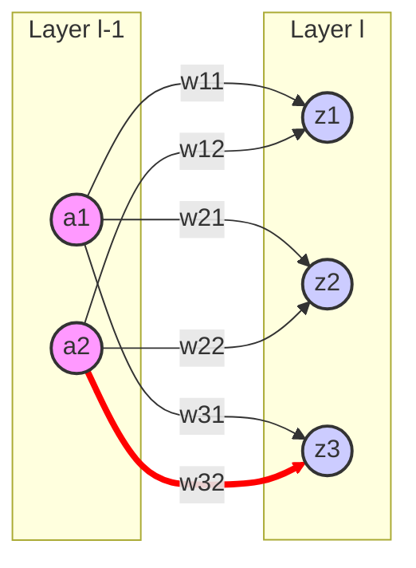

We will apply the formulae shown in [[MLP Basics|this]] to a neural network with 2 layers (2 neurons, 3 neurons)

## Network Setup
**Architecture:** Layer $l-1$ (2 neurons) connected to Layer $l$ (3 neurons).

w32 means to "3" from "2"

**Weight Notation:**
$w_{jk}$ means weight **To** neuron $j$ **From** neuron $k$.
* Example: Weight connecting neuron 2 (layer $l-1$) to neuron 3 (layer $l$) is $w_{32}$.

**Matrix Dimensions:**
The matrix connecting layer $l-1$ with $l$ is size $3 \times 2$.

$$
W = 
\begin{bmatrix} 
w_{11} & w_{12} \\ 
w_{21} & w_{22} \\ 
w_{31} & w_{32} 
\end{bmatrix}
$$

**Forward Pass:**
The activation $a^l$ is calculated as:
$$
a^l = \sigma(W a^{l-1} + b^l)
$$

Expanded matrix form:
$$
\begin{bmatrix} a_1^l \\ a_2^l \\ a_3^l \end{bmatrix} 
= 
\sigma \left( 
\begin{bmatrix} 
w_{11} & w_{12} \\ 
w_{21} & w_{22} \\ 
w_{31} & w_{32} 
\end{bmatrix} 
\begin{bmatrix} a_1^{l-1} \\ a_2^{l-1} \end{bmatrix} 
+ 
\begin{bmatrix} b_1^l \\ b_2^l \\ b_3^l \end{bmatrix} 
\right)
$$

Which expands to:
$$
\begin{bmatrix} a_1^l \\ a_2^l \\ a_3^l \end{bmatrix} 
= 
\begin{bmatrix} 
\sigma(w_{11}a_1^{l-1} + w_{12}a_2^{l-1} + b_1^l) \\ 
\sigma(w_{21}a_1^{l-1} + w_{22}a_2^{l-1} + b_2^l) \\ 
\sigma(w_{31}a_1^{l-1} + w_{32}a_2^{l-1} + b_3^l) 
\end{bmatrix}
$$
## Gradient w.r.t Activations

**1. Output Layer Error ($\delta^l$):**
The error at the final layer is the gradient of the Cost w.r.t $z$, found using the Hadamard product ($\odot$):

$$
\delta^l = \nabla_a C \odot \sigma'(z^l)
$$

Where:
* $\nabla_a C$ is the sensitivity of the Cost to the activations $(a^l - y)$.
* $\sigma'(z^l)$ is the derivative of the activation function.

**Cost Function:**
$$
Cost = \frac{1}{2} \sum_{k=1}^{3} (a_k^l - y_k)^2
$$

**Expanded $\delta^l$:**
$$
\delta^l = 
\begin{bmatrix} (a_1 - y_1) \\ (a_2 - y_2) \\ (a_3 - y_3) \end{bmatrix} 
\odot 
\begin{bmatrix} \sigma'(z_1^l) \\ \sigma'(z_2^l) \\ \sigma'(z_3^l) \end{bmatrix}
$$

---

**2. Backpropagating Error ($\delta^{l-1}$):**
To find the error at the previous layer, we transpose the weights and multiply by the current error:

$$
\delta^{l-1} = ((W^l)^T \delta^l) \odot \sigma'(z^{l-1})
$$

Using the transpose matrix $(W^l)^T$ (which is $2 \times 3$):
$$
(W^l)^T = 
\begin{bmatrix} 
w_{11} & w_{21} & w_{31} \\ 
w_{12} & w_{22} & w_{32} 
\end{bmatrix}
$$
## Error Propagation Detail

Calculating $(W^l)^T \delta^l$:

$$
\begin{bmatrix} 
w_{11} & w_{21} & w_{31} \\ 
w_{12} & w_{22} & w_{32} 
\end{bmatrix}
\begin{bmatrix} \delta_1^l \\ \delta_2^l \\ \delta_3^l \end{bmatrix}
=
\begin{bmatrix} 
w_{11}\delta_1^l + w_{21}\delta_2^l + w_{31}\delta_3^l \\ 
w_{12}\delta_1^l + w_{22}\delta_2^l + w_{32}\delta_3^l 
\end{bmatrix}
$$

**Intuition:**
* The error for **Neuron 1** in layer $l-1$ is decided by the "blame" given by all neurons in layer $l$ that it connected to.
* Note: If the network only has two layers (Input $\to$ Output), we technically don't need to calculate $\delta^{l-1}$ for updating weights, as we don't update input values.

## Final Gradients

**Weight Gradient:**
The gradient for the weights is the outer product of the current layer's error and the previous layer's activation.

$$
\frac{\partial C}{\partial w^l} = \delta^l (a^{l-1})^T
$$

$$
= \begin{bmatrix} \delta_1^l \\ \delta_2^l \\ \delta_3^l \end{bmatrix} 
\begin{bmatrix} a_1^{l-1} & a_2^{l-1} \end{bmatrix}
= 
\begin{bmatrix} 
\delta_1^l a_1^{l-1} & \delta_1^l a_2^{l-1} \\ 
\delta_2^l a_1^{l-1} & \delta_2^l a_2^{l-1} \\ 
\delta_3^l a_1^{l-1} & \delta_3^l a_2^{l-1} 
\end{bmatrix}
$$

**Bias Gradient:**
The gradient for the bias is simply the error term itself.
$$
\text{Bias Gradient } = \delta^l = \begin{bmatrix} \delta_1^l \\ \delta_2^l \\ \delta_3^l \end{bmatrix}
$$

---

## Gradient Descent Update

We update the parameters using the learning rate $\eta$:

**Weight Update:**
$$
w^l_{new} = w^l - \eta \frac{\partial C}{\partial w^l}
$$

**Bias Update:**
$$
b^l_{new} = b^l - \eta \frac{\partial C}{\partial b^l}
$$

*Note: There are various strategies to decide the optimal value for $\eta$ (e.g., adaptive learning rates).*